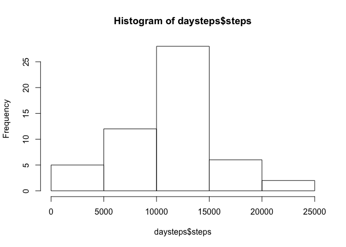
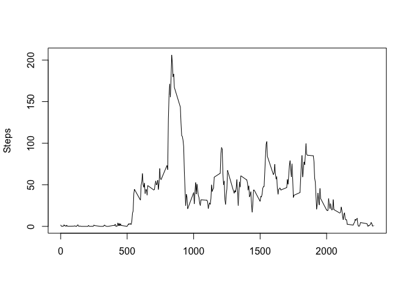
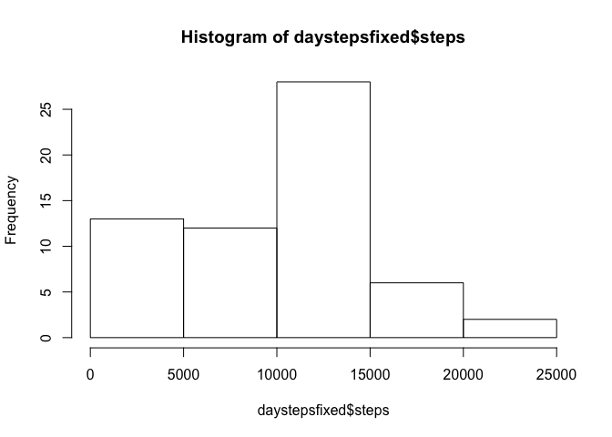
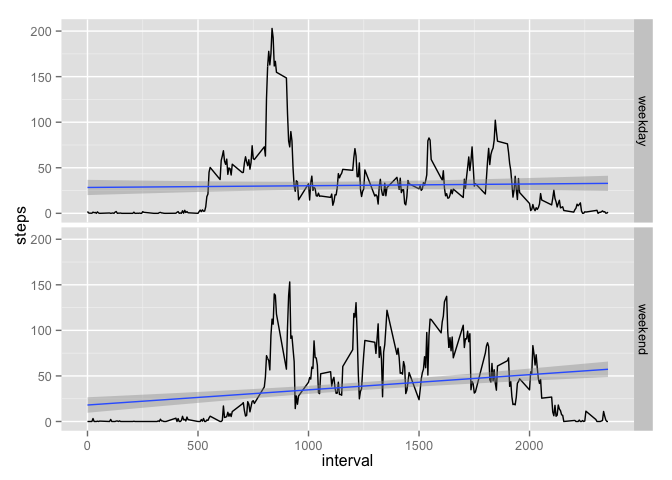

# Reproducible Research: Peer Assessment 1


## Loading and preprocessing the data

Loading and installing the packages:

```r
    setwd("/Users/rubensbarreto/Documents/R_Space/ReproductivleResearch/RepData_PeerAssessment1")
    unzip("activity.zip")
    file <- read.csv("activity.csv", header = TRUE, sep = ",")
    library(plyr)
```

```
## Warning: package 'plyr' was built under R version 3.1.2
```

```r
    library(ggplot2)
```

## What is mean total number of steps taken per day?

The histogram per day is:


```r
    daysteps <- aggregate(steps ~ date, data = file, sum)
    hist(daysteps$steps)
```

 

The mean and the median are:


```r
    mean(daysteps$steps)
```

```
## [1] 10766.19
```

```r
    median(daysteps$steps)
```

```
## [1] 10765
```

## What is the average daily activity pattern?

The time series is and the Maximun steps in the 5 min interval is:

```r
    averagesteps <- aggregate(steps ~ interval, data = file, mean)
    plot(averagesteps$interval,averagesteps$steps, type = "l", xlab = "", ylab = "Steps")
```

 

```r
    max(file$steps, na.rm = TRUE)
```

```
## [1] 806
```

## Imputing missing values
The total number of missin values are:

```r
    sum(is.na(file$steps))
```

```
## [1] 2304
```

Data set with the missing data filled in, the histogram, mean and median are:

```r
    filefixed <- file
    for(i in seq_along(filefixed$steps)){
        dt <- filefixed[i,2]
        if(is.na(filefixed[i,1])){
            daymean <- daysteps[daysteps==as.character(dt),2]
            if(length(daymean)==0){daymean <- 0}
                filefixed[i,1] <- daymean
        }
    }
    daystepsfixed <- aggregate(steps ~ date, data = filefixed, sum)
    hist(daystepsfixed$steps)
```

 

```r
    mean(daystepsfixed$steps)
```

```
## [1] 9354.23
```

```r
    median(daystepsfixed$steps)
```

```
## [1] 10395
```


## Are there differences in activity patterns between weekdays and weekends?

Creating a new variable "weekday" and "weekend"


```r
    filefixed <- mutate(filefixed, weekday = weekdays(as.Date(date)))
    filefixed[filefixed$weekday %in% c("Saturday", "Sunday"), 4] <- "weekend"
    filefixed[filefixed$weekday %in% c("Monday", "Tuesday", "Wednesday", "Thursday", "Friday"), 4] <- "weekday"
    filefixed$weekday <- as.factor(filefixed$weekday)
```

Plotting the Graph:


```r
averagesteps2 <- aggregate(steps ~ interval + weekday, data = filefixed, mean)
p <- qplot(interval, steps, data = averagesteps2, geom = c("line", "smooth"), method = "lm", facets = weekday~. )
print(p)
```

 


